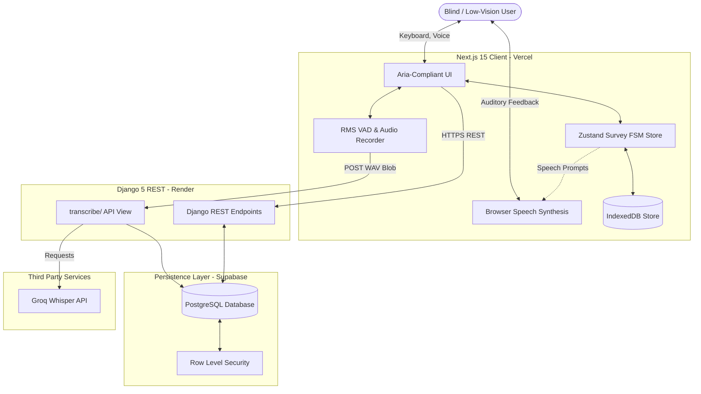
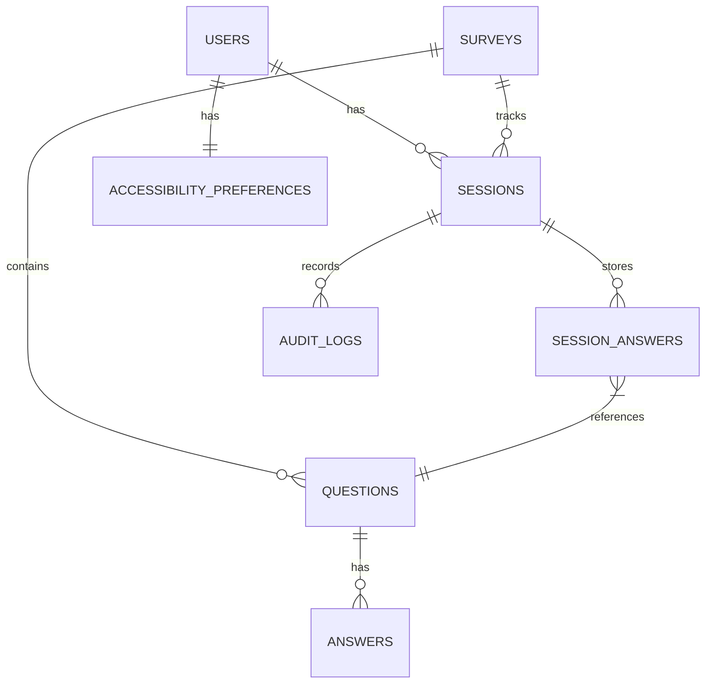

# System Architecture & Technical Specification - Saathi

## 1. System Topology Diagram


---

## 2. Supabase PostgreSQL Database Schema
To support quick cloud setup while keeping the database highly portable, we design standard SQL DDL compatible with Supabase PostgreSQL.
- **UUID Generation:** We use standard PG `gen_random_uuid()` from the `pgcrypto` extension (enabled by default in Supabase/PostgreSQL 13+).
- **Row Level Security (RLS):** All tables are created with RLS enabled. We establish policies that permit access based on `user_id` or `session_id`, preparing the database for Supabase Auth migration without tight lock-in.

### Entity Relationship Diagram


### SQL Table Schema (DDL)

```sql
-- Ensure pgcrypto is enabled for uuid generation
CREATE EXTENSION IF NOT EXISTS pgcrypto;

-- 1. Users Table
CREATE TABLE users_user (
    id UUID PRIMARY KEY DEFAULT gen_random_uuid(),
    email VARCHAR(255) UNIQUE,
    role VARCHAR(50) NOT NULL DEFAULT 'participant', -- 'admin', 'participant'
    created_at TIMESTAMP WITH TIME ZONE DEFAULT CURRENT_TIMESTAMP
);

-- Enable RLS on Users
ALTER TABLE users_user ENABLE ROW LEVEL SECURITY;

-- 2. Accessibility Preferences Table (Profile-level preferences, persistent across sessions)
CREATE TABLE users_accessibilitypreferences (
    id UUID PRIMARY KEY DEFAULT gen_random_uuid(),
    user_id UUID NOT NULL REFERENCES users_user(id) ON DELETE CASCADE,
    speech_rate NUMERIC(3,2) NOT NULL DEFAULT 1.00,
    speech_volume NUMERIC(3,2) NOT NULL DEFAULT 1.00,
    text_scale NUMERIC(3,2) NOT NULL DEFAULT 1.00,
    high_contrast BOOLEAN NOT NULL DEFAULT FALSE,
    reduced_motion BOOLEAN NOT NULL DEFAULT FALSE,
    preferred_voice VARCHAR(100) NOT NULL DEFAULT 'default',
    preferred_language VARCHAR(10) NOT NULL DEFAULT 'en'
);
CREATE UNIQUE INDEX idx_preferences_user ON users_accessibilitypreferences(user_id);

ALTER TABLE users_accessibilitypreferences ENABLE ROW LEVEL SECURITY;

-- 3. Surveys Table
CREATE TABLE surveys_survey (
    id UUID PRIMARY KEY DEFAULT gen_random_uuid(),
    title VARCHAR(255) NOT NULL,
    description TEXT NOT NULL,
    is_active BOOLEAN NOT NULL DEFAULT TRUE,
    default_language VARCHAR(10) NOT NULL DEFAULT 'en',
    created_at TIMESTAMP WITH TIME ZONE DEFAULT CURRENT_TIMESTAMP,
    updated_at TIMESTAMP WITH TIME ZONE DEFAULT CURRENT_TIMESTAMP
);

ALTER TABLE surveys_survey ENABLE ROW LEVEL SECURITY;

-- 4. Questions Table (Dynamic Question Types & Skip Logic)
CREATE TABLE surveys_question (
    id UUID PRIMARY KEY DEFAULT gen_random_uuid(),
    survey_id UUID NOT NULL REFERENCES surveys_survey(id) ON DELETE CASCADE,
    "order" INTEGER NOT NULL,
    question_text JSONB NOT NULL, -- Multilingual object: {"en": "Text", "hi": "पाठ", "te": "పాఠం"}
    question_type VARCHAR(50) NOT NULL, -- 'single_choice', 'multi_choice', 'text', 'scale', 'boolean', 'ranking', 'matrix', 'date', 'time', 'audio_response'
    options JSONB, -- Array of objects: [{"id": "opt1", "text": {"en": "Option 1"}}]
    routing_rules JSONB, -- Skip branching logic configuration
    required BOOLEAN NOT NULL DEFAULT TRUE
);
CREATE INDEX idx_questions_survey_order ON surveys_question(survey_id, "order");

ALTER TABLE surveys_question ENABLE ROW LEVEL SECURITY;

-- 5. Sessions Table
CREATE TABLE responses_session (
    id UUID PRIMARY KEY DEFAULT gen_random_uuid(),
    survey_id UUID NOT NULL REFERENCES surveys_survey(id) ON DELETE CASCADE,
    user_id UUID REFERENCES users_user(id) ON DELETE SET NULL, -- User associated with the session
    current_question_id UUID REFERENCES surveys_question(id) ON DELETE SET NULL,
    language VARCHAR(10) NOT NULL DEFAULT 'en',
    accessibility_mode VARCHAR(50) NOT NULL DEFAULT 'assisted',
    status VARCHAR(50) NOT NULL DEFAULT 'started', -- 'started', 'paused', 'completed'
    created_at TIMESTAMP WITH TIME ZONE DEFAULT CURRENT_TIMESTAMP,
    updated_at TIMESTAMP WITH TIME ZONE DEFAULT CURRENT_TIMESTAMP,
    completed_at TIMESTAMP WITH TIME ZONE
);

ALTER TABLE responses_session ENABLE ROW LEVEL SECURITY;

-- 6. Session Answers Table
CREATE TABLE responses_sessionanswer (
    id UUID PRIMARY KEY DEFAULT gen_random_uuid(),
    session_id UUID NOT NULL REFERENCES responses_session(id) ON DELETE CASCADE,
    question_id UUID NOT NULL REFERENCES surveys_question(id) ON DELETE CASCADE,
    answer_value JSONB NOT NULL,
    is_confirmed BOOLEAN NOT NULL DEFAULT FALSE,
    confidence_score NUMERIC(5, 2),
    created_at TIMESTAMP WITH TIME ZONE DEFAULT CURRENT_TIMESTAMP,
    updated_at TIMESTAMP WITH TIME ZONE DEFAULT CURRENT_TIMESTAMP,
    CONSTRAINT unique_session_question UNIQUE (session_id, question_id)
);

ALTER TABLE responses_sessionanswer ENABLE ROW LEVEL SECURITY;

-- 7. Audit Log Table
CREATE TABLE responses_auditlog (
    id UUID PRIMARY KEY DEFAULT gen_random_uuid(),
    session_id UUID NOT NULL REFERENCES responses_session(id) ON DELETE CASCADE,
    action VARCHAR(100) NOT NULL,
    payload JSONB,
    created_at TIMESTAMP WITH TIME ZONE DEFAULT CURRENT_TIMESTAMP
);
CREATE INDEX idx_auditlog_session ON responses_auditlog(session_id);

ALTER TABLE responses_auditlog ENABLE ROW LEVEL SECURITY;
```

### RLS Policies Strategy
To guarantee database portability and allow migration outside Supabase:
1. **Survey Metadata Access:** Open to public read policies.
   ```sql
   CREATE POLICY "Allow public read of active surveys" ON surveys_survey
       FOR SELECT USING (is_active = true);
   ```
2. **Session & Answer Modifiability:** Bound strictly to session owners. Clients authenticate using the `session_id` UUID in headers (`X-Session-ID`), and RLS policies evaluate matching IDs.
   ```sql
   CREATE POLICY "Allow session owners to insert answers" ON responses_sessionanswer
       FOR INSERT WITH CHECK (session_id = auth.uid() OR session_id = current_setting('request.headers')::json->>'x-session-id')::uuid;
   ```
3. **User Preferences Modifiability:** Bound strictly to user profile.
   ```sql
   CREATE POLICY "Allow user to modify own accessibility preferences" ON users_accessibilitypreferences
       FOR ALL USING (user_id = auth.uid() OR user_id = (current_setting('request.headers')::json->>'x-user-id')::uuid);
   ```

---

## 3. Zustand Survey State Machine Summary
The frontend client uses Zustand FSM to process survey progression. The state definitions conform strictly to [STATE_MACHINE_SPEC.md](file:///d:/Project%20Netra/Saathi/docs/STATE_MACHINE_SPEC.md).

State list:
- `IDLE`, `LANGUAGE_SELECTION`, `TUTORIAL`, `MIC_PERMISSION`, `QUESTION_READING`, `LISTENING`, `PROCESSING`, `CONFIRMING`, `HELP`, `PAUSED`, `RECOVERY`, `ERROR`, `COMPLETED`.

---

## 4. Voice Engine & REST/Synthesis Pipeline
We capture 16-bit Mono PCM audio at 16kHz during user speech. When the local VAD triggers speech end, the compiled WAV audio blob is uploaded to the backend view `/api/speech/transcribe/` which forwards the payload to Groq Whisper (`whisper-large-v3` or configured model) to resolve the transcript. All text-to-speech rendering is performed locally using the browser's native `window.speechSynthesis` API via the language-aware `BrowserTTSService`.

---


## 5. Experience Completion, Offline Synchronization & VAD Architecture

### 5.1 Chronological Offline Synchronization
To preserve data integrity during intermittent connectivity:
- **Persistence Store:** Answers are written to Dexie IndexedDB with `synced: 0` and a `created_at` timestamp.
- **Strict Chronological Ordering:** Re-synchronization retrieves unsynced rows ordered strictly by `created_at` (ascending). This preserves answer sequence guarantees without relying on question IDs.
- **Concurrent Lock Prevention:** A set of in-memory active syncing IDs (`activeSyncingIds`) locks rows currently in transit, ensuring multiple sync runs do not result in duplicate API submissions.

### 5.2 Voice Activity Detection (VAD) & Watchdog
Client-side voice activity detection analyzes local RMS energy to manage the listening cycle:
- **Dynamic Thresholding:** Baseline noise level is calculated during a 2-second initial calibration, and updated adaptively when the user is not speaking: `threshold = Math.min(Math.max(noiseFloor + speechThresholdMargin, minThreshold), maxThreshold)`.
- **Calibration Fallback:** If calibration fails due to errors, mute states, or high background noise, the system enforces a conservative default noise floor of `0.01` (producing a threshold of `0.025`). This guarantees that the survey remains fully usable.
- **Scenario H (Slow Speaker Tolerance):** The silence duration threshold (`silenceDurationMs`) is configured to `2000ms`. The VAD ignores silent pauses up to 2.0 seconds, preventing premature cutoffs for slow speakers.
- **VAD Watchdog:** To prevent a stuck `LISTENING` state in the event of continuous ambient noise, a watchdog timer enforces a `maxListeningDurationMs` (defaulting to `120000ms`). If exceeded, the FSM transitions directly from `LISTENING` to `PROCESSING` to verify any captured utterance.

