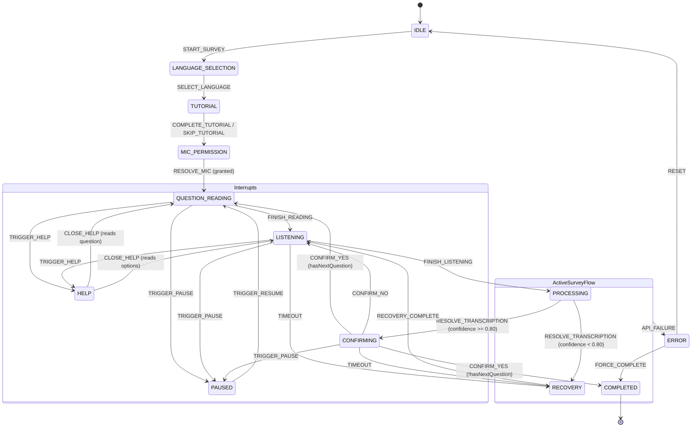

# State Machine Specification - Saathi

This document defines the strict, deterministic Finite State Machine (FSM) driving the survey client experience in Saathi. The state machine ensures logical navigation flow, keyboard accessibility, screen-reader synchronization, and robust error recovery.

---

## 1. State Machine Topology (Mermaid Diagram)

---

## 2. Transition Mapping Table

| Origin State | Event Trigger | Guard Conditions | Destination State | Transition Description / Actions |
|---|---|---|---|---|
| **IDLE** | `START_SURVEY` | Survey ID and starting question ID initialized | **LANGUAGE_SELECTION** | Exit IDLE state. Load language select options in context. |
| **LANGUAGE_SELECTION** | `SELECT_LANGUAGE` | Language code is valid (en/hi/te/es) | **TUTORIAL** | Set `currentLanguage` in context. Synthesize locale greeting. |
| **TUTORIAL** | `COMPLETE_TUTORIAL` | None | **MIC_PERMISSION** | Close tutorial playback context. Play transitional sound. |
| **TUTORIAL** | `SKIP_TUTORIAL` | None | **MIC_PERMISSION** | Skip tutorial guide. |
| **MIC_PERMISSION** | `RESOLVE_MIC` | Payload contains true/false permission state | **QUESTION_READING** | If `granted=true`, save `microphoneGranted=true`. Set mode to Self-Guided. If `false`, set mode to Assisted (screen reader only). |
| **QUESTION_READING** | `FINISH_READING` | None | **LISTENING** | Synth completed reading text. Play WAKE sound cue. Open microphone channels. |
| **QUESTION_READING** | `TRIGGER_HELP` | None | **HELP** | Store `helpReturnState = QUESTION_READING`. Speak help instructions. |
| **QUESTION_READING** | `TRIGGER_PAUSE` | None | **PAUSED** | Store `pausedReturnState = QUESTION_READING`. Halt audio outputs. |
| **LISTENING** | `FINISH_LISTENING` | VAD detects user finished speaking | **PROCESSING** | Stop audio stream capture. Play PROCESSING cue. Post chunks to server. |
| **LISTENING** | `TIMEOUT` | No speech detected for 6000ms | **RECOVERY** | Play ALERT cue. Synthesize rephrased repeat request. |
| **LISTENING** | `TRIGGER_HELP` | None | **HELP** | Store `helpReturnState = LISTENING`. Speak helper text. |
| **LISTENING** | `TRIGGER_PAUSE` | None | **PAUSED** | Store `pausedReturnState = LISTENING`. Shut down active mic stream. |
| **PROCESSING** | `RESOLVE_TRANSCRIPTION` | Confidence score >= 0.80 | **CONFIRMING** | Save `candidateAnswer` and `transcriptionConfidence`. Speak confirmation prompt: "You answered: X. Is this correct?" |
| **PROCESSING** | `RESOLVE_TRANSCRIPTION` | Confidence score < 0.80 | **RECOVERY** | Save `transcriptionConfidence`. Speak retry instructions. |
| **PROCESSING** | `API_FAILURE` | Error message payload present | **ERROR** | Save `lastError`. Play ALERT cue. |
| **CONFIRMING** | `CONFIRM_YES` | More questions exist in survey (`hasNextQuestion=true`) | **QUESTION_READING** | POST answer to Local DB. Set `candidateAnswer=null`. Shift question ID reference. |
| **CONFIRMING** | `CONFIRM_YES` | No questions left (`hasNextQuestion=false`) | **COMPLETED** | Write completed session response to IndexedDB. Trigger COMPLETE sound cue. |
| **CONFIRMING** | `CONFIRM_NO` | None | **LISTENING** | Discard candidate answer. Re-open audio stream buffer. |
| **CONFIRMING** | `TIMEOUT` | No voice validation input for 6000ms | **RECOVERY** | Ask user to repeat yes/no choice. |
| **CONFIRMING** | `TRIGGER_PAUSE` | None | **PAUSED** | Store `pausedReturnState = CONFIRMING`. Pause speech channel. |
| **HELP** | `CLOSE_HELP` | None | **QUESTION_READING** / **LISTENING** | Recover state from `helpReturnState`. Resume previous reading/listening point. |
| **PAUSED** | `TRIGGER_RESUME` | None | **QUESTION_READING** / **LISTENING** | Recover state from `pausedReturnState`. Re-open microphone if previous state was LISTENING. |
| **RECOVERY** | `RECOVERY_COMPLETE` | Recovery prompt finishes speaking | **LISTENING** | Re-open speech capture channels and play WAKE sound. |
| **ERROR** | `RESET` | None | **IDLE** | Re-initialize the state context completely. |
| **ERROR** | `FORCE_COMPLETE` | None | **COMPLETED** | Force save partial results and complete session. |

---

## 3. Invalid Transition Handling

To prevent software exceptions and keep UI components predictable:
1. **Defensive Guards:** The `send` event dispatcher passes incoming requests through `canTransition(current, event)`.
2. **State Freeze:** If an event has no mapping in the `TRANSITIONS` matrix for the active state, the event is silently ignored. The current state and context parameters are preserved intact.
3. **Trace Warnings:** In development mode (`process.env.NODE_ENV !== 'production'`), trying to execute an invalid transition outputs a warning trace to the console (e.g., `Invalid transition event X in state Y`).
4. **No Side-Effects:** Since invalid transitions are blocked before reaching state setters, no entry or exit actions are executed, preventing audio synthesis overlaps or duplicate API postings.

---

## 4. State Persistence Strategy

To withstand battery drainage, network loss, browser crashes, or accidental page reloads, Saathi employs a robust persistence strategy:

1. **State Snapshots:**
   - On every successful state modification, the Zustand store serializes the `SurveyFsmContext` (excluding audio streams).
   - The serialized object is written immediately to IndexedDB (`db.answers` and `db.preferences` tables).
2. **Resume Handshake:**
   - On application mount, the `AccessibilityProvider` reads the active session ID from local storage.
   - If a session is marked `started` or `paused`, the FSM triggers a `SESSION_RECOVERED` event.
   - The store loads variables (`currentQuestionId`, `currentLanguage`, `user_id`) directly from IndexedDB, automatically shifting the state back to the exact question page.
3. **Transactional Relational Integrity:**
   - Session answer logs are stored in a dedicated `responses_sessionanswer` table inside Supabase.
   - If offline, the client continues updating IndexedDB answers. A service worker monitors connectivity status and posts queued responses to `/api/answers` when the network recovers.
