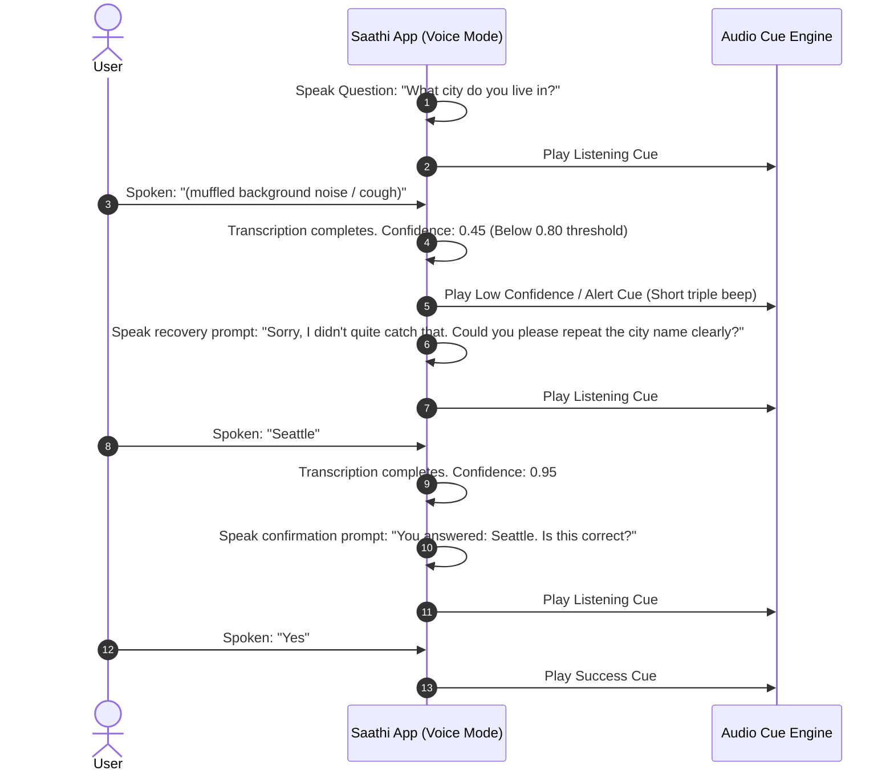

# User Flows - Saathi

This document describes the step-by-step user experience flows tailored specifically to accessibility scenarios. 

---

## 1. Flow A: Totally Blind User (Self-Guided Voice-First Mode)

```mermaid
sequenceDiagram
    autonumber
    actor User as Totally Blind User
    participant App as Saathi App (Voice Mode)
    participant Sound as Audio Cue Engine
    participant Mic as Microphone Access

    User->>App: Navigates to Survey Landing Page
    App->>App: Auto-reads Page Title & Welcome Prompt
    App->>Sound: Play Soft Welcome Chime
    App->>App: Request Mic Permission (Standard Browser Pop-up)
    App->>App: Audio Announcement: "Saathi is request microphone permission to start voice mode. Please select Allow."
    User->>Mic: Approves Microphone Permission
    App->>Sound: Play Success Chime (High Pitch)
    App->>App: Enter Self-Guided Mode (No UI buttons needed, continuous VAD active)
    
    rect rgb(30, 41, 59)
        Note over App, User: Question Lifecycle Loop
        App->>App: Synthesizes Question 1: "What is your primary method of navigation? 1. White Cane, 2. Guide Dog, 3. Visual assistance apps."
        App->>Sound: Play "Listening Started" Cue (Gentle double-click sound)
        App->>App: Open Mic Listening Buffer
        User->>App: Spoken: "White cane"
        App->>App: VAD detects silence. Stop listening.
        App->>Sound: Play "Processing" Cue (Soft pulse)
        App->>App: Transcription completes. Confidence: 0.94. Candidate: "White Cane"
        App->>App: Speak confirmation prompt: "You answered: White Cane. Is this correct?"
        App->>Sound: Play "Listening Started" Cue
        User->>App: Spoken: "Yes"
        App->>App: Transcribes: "Yes". Confidence: 0.98
        App->>Sound: Play Confirmed Cue (Short positive chord)
        App->>App: Auto-saves Progress to local cache & Backend DB
    end

    App->>App: Question 2: "In one word, how would you describe..."
    App->>Sound: Play "Listening Started" Cue
    User->>App: Spoken: "Excellent"
    App->>App: Transcription completes. Confidence: 0.91
    App->>App: Speak confirmation prompt: "You answered: Excellent. Is this correct?"
    App->>Sound: Play "Listening Started" Cue
    User->>App: Spoken: "No"
    App->>Sound: Play Cancel Cue (Negative slide)
    App->>App: "Let's try again. Question 2: In one word, how would you describe..."
    App->>Sound: Play "Listening Started" Cue
    User->>App: Spoken: "Incredible"
    App->>App: Confirmation Prompt -> User says "Yes" -> Store Answer
    
    App->>App: Reaches End of Survey
    App->>App: Speaks: "Thank you for completing the survey. Your response has been securely saved."
    App->>Sound: Play Exit Chime
```

---

## 2. Flow B: Low-Vision Keyboard User (Assisted & Low-Vision Modes)

```mermaid
sequenceDiagram
    autonumber
    actor User as Low Vision Keyboard User
    participant UI as Saathi UI (High Contrast & Large Font)
    participant Reader as Screen Reader / Aria Live
    participant Store as State Store

    User->>UI: Press Tab to focus Welcome Button
    UI->>Reader: Announce: "Welcome to Saathi Survey. Press Enter to begin. Press Alt + C to toggle high contrast."
    User->>UI: Press Alt + C
    UI->>Store: Toggle Contrast Theme (Switches to black background, pure yellow text)
    UI->>Reader: Announce: "High contrast mode activated. Black and yellow palette."
    User->>UI: Press Enter (Launches Survey)
    
    rect rgb(40, 20, 20)
        Note over UI, Reader: Question Focus Flow
        UI->>UI: Render Question 1: "Rate your experience from 1 to 5."
        UI->>Reader: Announce: "Question 1: Rate your experience from 1 to 5. Tab to select radio options."
        User->>UI: Tab to Radio Option '4'
        UI->>Reader: Announce: "Radio option 4, selected. Tab to confirm button."
        User->>UI: Tab to "Confirm Answer" button
        UI->>Reader: Announce: "Confirm button. Press Enter to submit answer."
        User->>UI: Press Enter
        UI->>Store: Save answer, advance state.
    end

    UI->>Reader: Announce: "Answer submitted. Moving to Question 2."
```

---

## 3. Flow C: Recovery Flow (Speech Recognition Errors)

This flow specifies what happens when a user speaks something unrecognizable or when the Speech API returns low-confidence output.

