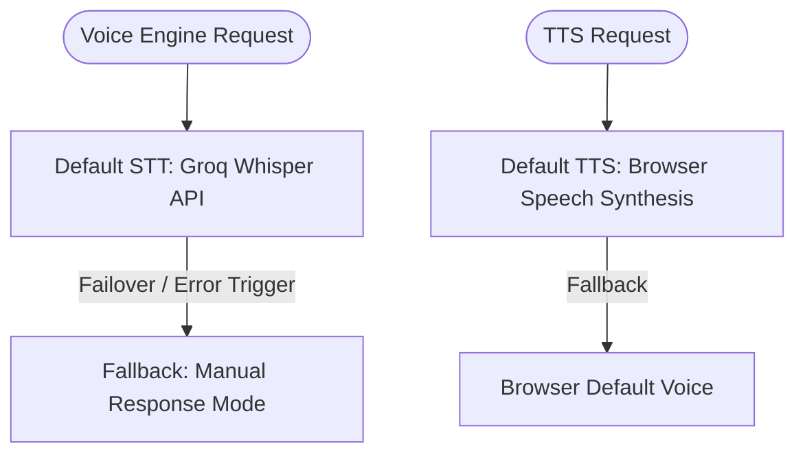

# Voice Provider Specification - Saathi

This specification documents the multi-provider speech infrastructure, default execution paths, failover rules, and local synthesis behaviors.

---

## 1. Supported Providers

1. **Groq Whisper (Default Speech-to-Text)**
   - Technology: REST API via server proxy (`POST /api/speech/transcribe/`).
   - Protocol: Multipart audio file upload (`audio/wav`) containing 16kHz Int16 Mono PCM data.
   - Model: Configurable via `GROQ_WHISPER_MODEL` (defaults to `whisper-large-v3`).
   - Characteristics: Low latency, highly accurate multilingual transcription (supporting English, Hindi, Telugu, Tamil, Kannada, Marathi, Gujarati, Bengali, Malayalam).

2. **Browser Web Speech Synthesis (Default Text-to-Speech)**
   - Technology: Local browser Web Speech API (`window.speechSynthesis`).
   - Protocol: Client-side rendering via custom `BrowserTTSService` class.
   - Characteristics: 100% offline support, zero API cost, language-aware voice matching for 9 regional Indian languages.

3. **OpenAI Realtime & Azure Cognitive Speech (Deprecated)**
   - Status: Deprecated. Extracted from the active execution path for pilot simplicity and credentials security. Retained in the codebase for potential future reactivation.

---

## 2. Provider Priority & Fallback

The voice engine operates on a simplified execution path to ensure credentials isolation and pilot simplicity:

- **Speech-to-Text Fallback:** If the Groq Whisper transcription REST endpoint fails (network timeout, API error, or credentials missing), the client immediately transitions to `MANUAL_RESPONSE` mode, enabling full keyboard-based text entry.
- **Text-to-Speech Fallback:** The `BrowserTTSService` checks for regional voices (e.g. `Google हिन्दी`, `Microsoft Shruti Online` for Telugu, etc.) matching the active language. If none are found, it falls back to the browser's default speech synthesis voice.

---

## 3. Failure Conditions & Detectors

1. **REST API Timeout:**
   - Groq API request delay > `5000ms`.
2. **Network Offline:**
   - Browser detects offline state (`navigator.onLine === false`).
3. **Empty Transcript:**
   - Groq Whisper returns empty text (below confidence thresholds), triggering the FSM `RECOVERY` rephrase state.
